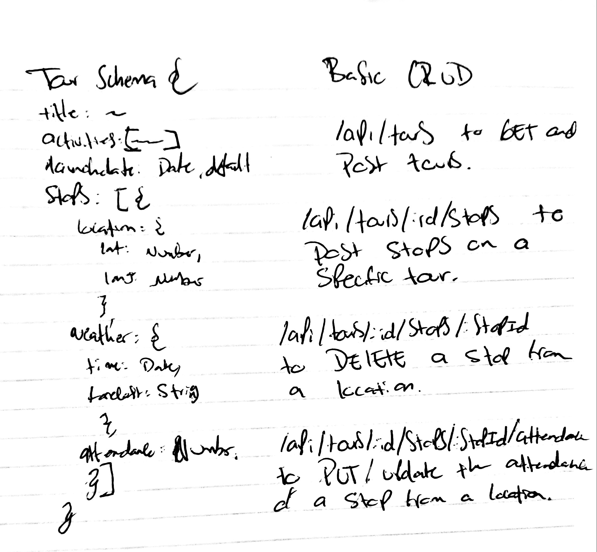

# lab-09

## Tour Manager

### Author: Antonella Gutierrez

### Links and Resources
* [submission PR](https://github.com/antonella-401-advanced-javascript/lab-09/pull/1)
* [travis](https://travis-ci.com/antonella-401-advanced-javascript/lab-09/builds/130134948)

###  API Server
Create a server for tracking travelling tours, including stops. On this tours the stops are not known until they happen, so the API needs to be able to add, update and remove stops.

* routing
	* method based functions (`app.get`)
	* response.send and response.json
	* order
	* parameters (route and query)
		* request
	* `app.use()`
* static files
* project structure
	* views, routes, static
	* `express.Router()`

### Middleware
* Parameters
* Route handling
  * Router object
* Middleware error handling

### Setup
#### .env requirements
* MONGODB_URI - mongodb://localhost:27017/tour-manager
* PORT - 3000
#### Running the app
* npm start
* npm start:watch
#### Tests
* Unit Tests: npm test
* Lint Tests: npm run lint
#### UML
